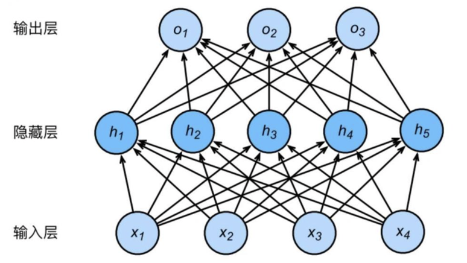
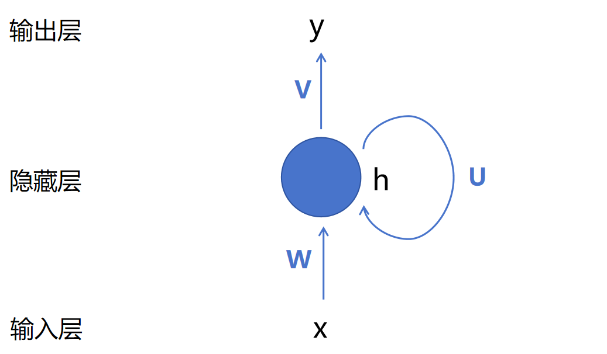
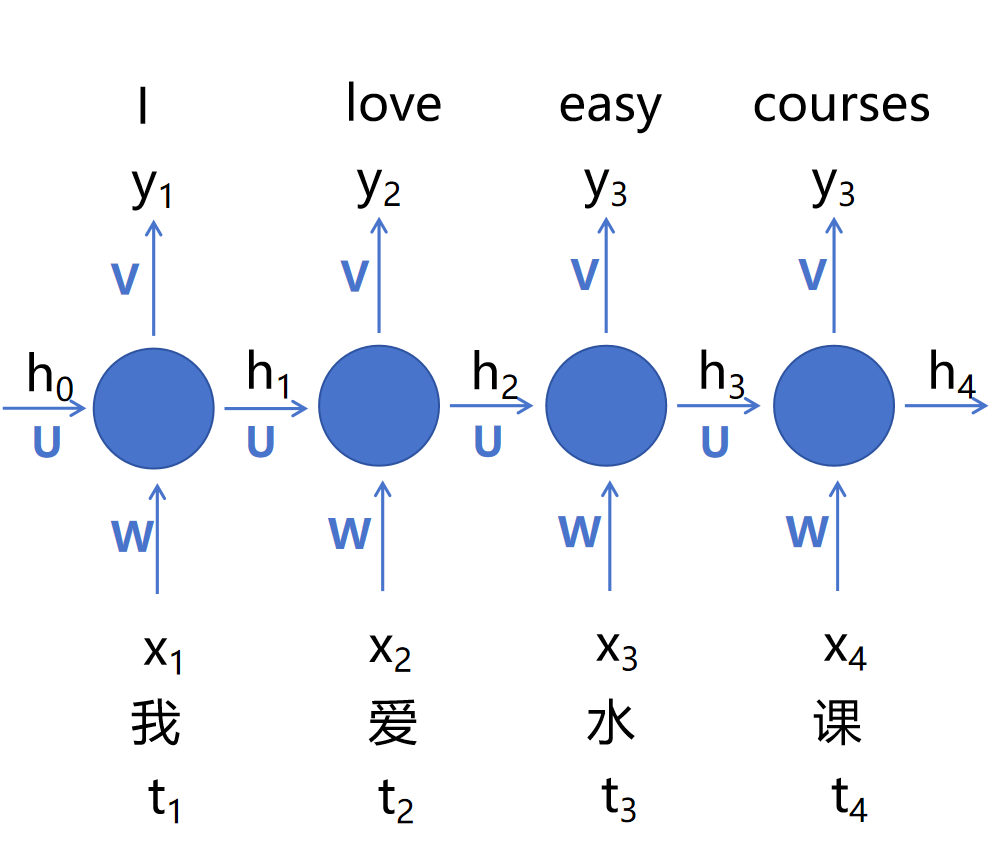
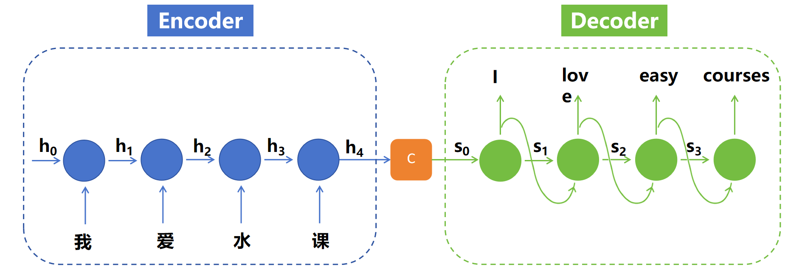
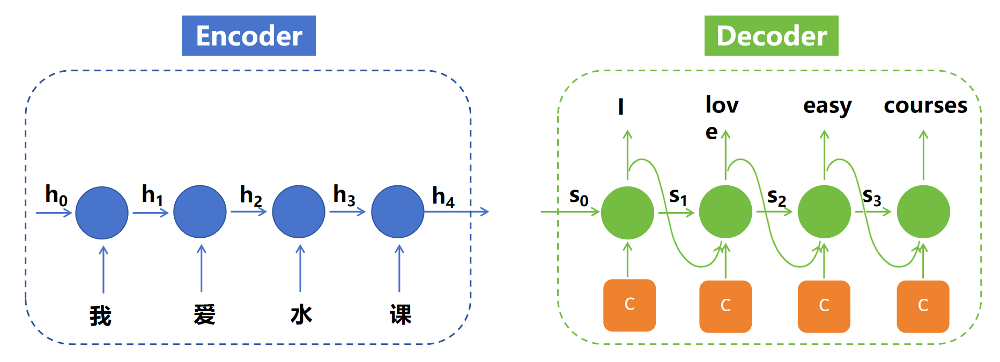

# Attention Is All You Need
整个文章我会用大白话来说，主要是为了方便理解，同时我觉得这是展示我对注意力机制的理解。
## 核心思想
在 Transformer 诞生之前，RNN 是处理序列数据的主要模型，但是RNN存在许多问题，比如梯度消失和梯度爆炸，这使得 RNN 在处理长序列数据时非常困难。这一点我会在后面我的理解中详细介绍。
而 Transformer 的核心思想是注意力机制，它可以让模型在处理序列数据时，关注到序列中的不同位置，从而更好地理解序列的含义。

###### 核心思想我就简单略过，现在我来详细讲解 Transformer 的运行机制。

## 我的思考
### I.RNN
###### 1.FNN
在介绍 RNN 之前，我还是想先介绍一下 FNN ，因为 RNN 是基于 FNN 的
这是FNN的结构图：

<strong>Figure FNN</strong>

FNN 相比 RNN ，FNN 需要固定维度的输入，对不同长度的句子处理效率低下，如果作为句子一个整体输入，无法理解谁先出现，谁后出现。
###### 2.RNN
但RNN就很厉害了，以下是RNN的优势：
能够建模词序：RNN 是按时间顺序（token 顺序）逐个处理输入的
能够建模上下文依赖：RNN 是逐个喂入词语，并且会有“记忆”机制
支持不定长输入：不再需要 FNN 那种固定长度的输入格式，句子多长都行

<strong>Figure Basic RNN</strong>

这是一个简单的 RNN 模型，它的输入(x)是一个序列，输出(y)是一个序列。同时，它还会有时间步(h)的概念，每个时间步会有一个隐藏状态，这个隐藏状态会被用来预测下一个时间步的输出。
而这是ht和yt的计算公式

<math xmlns="http://www.w3.org/1998/Math/MathML" display="inline"><mrow><mrow><msub><mi mathvariant="normal">h</mi><mrow><mi mathvariant="normal">t</mi></mrow></msub><mtext>&#x000A0;</mtext><mo>&#x0003D;</mo><mtext>&#x000A0;</mtext><mi mathvariant="normal">g</mi><mrow><mo stretchy="true" fence="true" form="prefix">&#x00028;</mo><msub><mi mathvariant="normal">W</mi><mrow><msub><mi mathvariant="normal">X</mi><mrow><mi mathvariant="normal">t</mi></mrow></msub></mrow></msub><mtext>&#x000A0;</mtext><mo>&#x0002B;</mo><mtext>&#x000A0;</mtext><mi mathvariant="normal">U</mi><msub><mi mathvariant="normal">h</mi><mrow><mi mathvariant="normal">t</mi><mo>&#x02212;</mo><mn>1</mn></mrow></msub><mo stretchy="true" fence="true" form="postfix">&#x00029;</mo></mrow></mrow></mrow></math>

<math xmlns="http://www.w3.org/1998/Math/MathML" display="inline"><mrow><mrow><mi mathvariant="normal">&#x00394;</mi><msub><mi mathvariant="normal">y</mi><mrow><mi mathvariant="normal">t</mi></mrow></msub><mtext>&#x000A0;</mtext><mo>&#x0003D;</mo><mtext>&#x000A0;</mtext><mrow><mi mathvariant="normal">g</mi></mrow><mrow><mo stretchy="true" fence="true" form="prefix">&#x00028;</mo><mi mathvariant="normal">V</mi><msub><mi mathvariant="normal">h</mi><mrow><mi mathvariant="normal">t</mi></mrow></msub><mo stretchy="true" fence="true" form="postfix">&#x00029;</mo></mrow></mrow></mrow></math>

同时，据我了解到，transfomer 最开始就是用于翻译任务的，那我们不妨就从翻译任务开始
如果把上述公式和初始图结合起来，就可以得到下面这个图

<strong>Figure RNN</strong>

这样，RNN 就可以处理序列数据了。而且没有 FNN 那样的固定长度输入，句子多长都行。也不会因为顺序问题而影响模型的性能。
但是这样的 RNN 也有一个问题，那就是如果输入输出不等长的话，会导致模型的性能下降。

所以，我们引入了编码器-解码器结构

<strong>Figure Encoder-Decoder</strong>

其中 C 是 “上下文向量（context vector）”。它是对整个输入序列的语义编码，是一个固定长度的向量，涵盖了整个输入文本的语义信息。
它将作为 Decoder 的输入，用于生成目标序列。
最简单的编码方式：C = 最后一个时间步的隐藏状态输出(h4)。

那么Encoder的输出C就可以由Decoder解码，从而生成目标序列。这样就解决了输入输出不等长的问题。

但是新的问题又来了，得到的C在Encoder的编码下，会随着时间的推移而变化，而其中的信息会逐渐被Decoder丢失和遗忘，导致生成的目标序列质量下降。说简单点，就是h1~3中的权重会变得很小，甚至丢失了重要的信息。
那如果我们及时截停，将得到的Ci作为Decoder的输入，兴许就可以解决这个问题。就比如这样：

这就是Attention机制的核心思想
注意力机制解决了模型处理长序列时的“遗忘”问题：随着序列长度的增长，远距离依赖信息在传递过程中易被稀释，导致模型对长距离依赖关系的建模能力减弱。
解决了不同时间步输入对当前时刻输出的“重要性”问题：所有时间步的输入在计算当前时刻输出时被同等对待，忽略了不同时间步对当前时刻输出的重要性可能存在的差异。

但是，Attention机制也有一个问题，那就是我们没法进行并行计算。因为Attention机制是基于序列的，所以我们只能一个一个地计算，而不能并行计算。

GPU 是并行计算的，所以我们没法并行计算 Attention 机制。
而有人就利用CNN的并行计算能力，将Attention机制的计算过程并行化，从而提高了模型的运行效率。但是，信息传递距离仍受限制（ConvS2S 是线性，ByteNet 是对数级），远距离依赖建模仍困难。
包括Memory Network：注意力机制替代 RNN 的递归，不再依赖 RNN，使用多轮注意力从“记忆”中读取信息，但是仍然有多轮递归过程（multi-hop attention），并不高效
###### 这里便不再细说，进入Transformer的讲解
### II. Transformer
在训练阶段，将数据输入到Transformer模型，首先会进行Word Embedding & Positional Encoding，将输入转换为512维的向量表示。
以全局的视角来看，我们知道了每个词语的位置，那我们就可以直接得到非目标位置的信息，而不需要依赖RNN那样的“记忆”机制，直接对目标位置的信息进行预测。就好比 “我” “爱” “水” “课” ，我的目标对象是 “水” ，我就可以直接得到 “I” “love” “class” 这三个词语的信息，而不需要依赖 “I” “love” 这两个词语的信息。并且，剩下的三个字也可以同时进行相同的操作，并列计算。
这就是Self-Attention机制
###### 这里其实我有点想不明白，AI说这样的操作会使模型训练和推理都变得更加高效，但是我觉得这样只会使得训练加快，而非推理加快，因为在实际的推理中，我们并不知道最终的结果
得到新的向量之后，它们就会进行 Multi-Head 操作，现在我们有三个矩阵 WQ，WK，WV，每组向量都会分别与这三个矩阵相乘，得到三组新的向量。原本的 “我” “爱” “水” “课” 这一组向量就会变成 “我Q” “爱Q” “水Q” “课Q” ，“我K” “爱K” “水K” “课K” ，“我V” “爱V” “水V” “课V” 这三组向量。
接着，“水Q” 会与 “我K” “爱K” “水K” “课K” 这四组向量进行点积操作，在经过缩放、归一化操作后，再与 “我V” “爱V” “水V” “课V” 进行加权求和，得到 “水*” 这一个向量，其他三个向量也会进行相同的操作，我就不再重复。
接着，他们都会进行Self-Attention操作，得到新的向量表示。
接着再进行残差连接和层归一化操作，得到新的向量表示。这样，我们就能得到上述 “相似化操作” 的结果，从而贴进了真实的答案。
剩下的操作就很简单了，在我的task02~05中都有用到，在readme中我也有详细的学习记录

###### 至此，2026寒假深度学习正式完成，感谢AI的帮助，如果没有AI的学习真的会很困难，这是一个相互促进的过程，AI帮助我完成学习，我也深刻认识了AI。希望在接下来的学习中，我能继续保持这个过程，不断提升自己的能力。