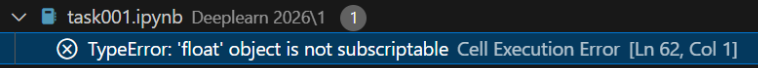
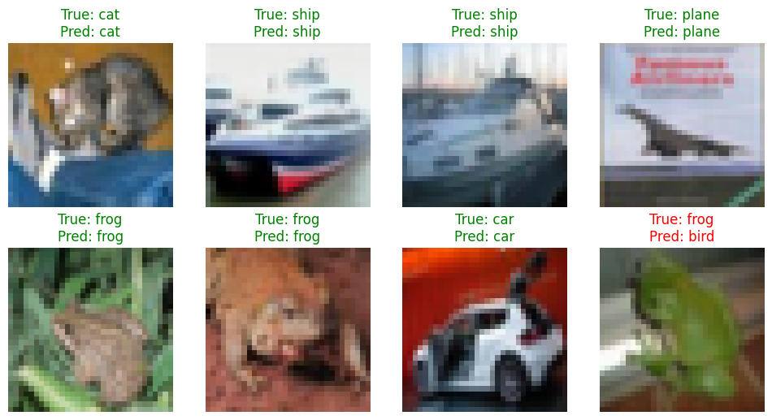
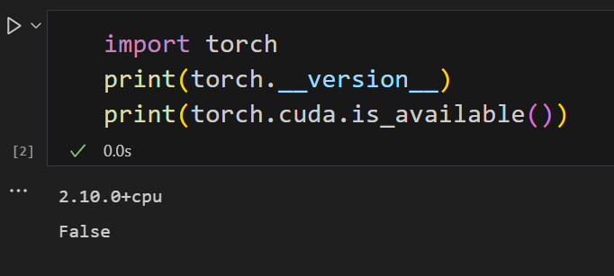

# Percented于寒假期间四川农业大学深度视觉农业实验室的作业
## 任务一： 
在安装 PyTorch 之前，我首先检查了本机的硬件环境，重点关注我的电脑具备可用于深度学习加速的NVIDIA显卡。 
通过nvidia-smi命令确认本机存在NVIDIA-GPU，并且显卡驱动已正确安装，支持CUDA计算。 
随后，我查阅了 PyTorch 官方网站提供的安装指南，对比了CPU版本与CUDA版本的区别。CPU版本仅使用处理器进行计算，而CUDA版本可以利用GPU进行并行加速，在模型训练和大规模矩阵运算中具有显著的性能优势。 
结合本机硬件条件以及后续可能涉及深度学习模型训练的需求，我最终选择安装 支持CUDA的PyTorch版本，以充分利用GPU的计算能力，提高运行效率。

在安装Anaconda及PyTorch相关依赖的过程中，我遇到了由于网络不稳定导致的安装问题，主要表现为下载速度过慢、连接超时或依赖包无法正常获取。 
针对该问题，我首先判断这并非配置或命令本身的错误，而是由网络环境限制造成的。随后通过多次切换网络环境，并使用网络代理工具改善网络连接质量，确保能够正常访问官方软件源和镜像站点。 
在网络条件稳定后，相关依赖包得以顺利下载并完成安装，环境配置问题得到解决。通过此次排错过程，我也加深了对软件安装过程中常见问题及其解决思路的理解。

## 任务二：
在完成一元非线性回归任务前，我首先进行了数据的加载与预处理工作。本次任务使用的数据集包含单一自变量x与因变量 y，我先通过pandas读取csv格式的数据集，将x与y的数值转换为浮点型数组，并调整其维度以匹配模型的输入要求，随后将数组转换为PyTorch张量，为后续模型训练做准备。
接着，我手动构建了MLP模型以拟合数据的非线性关系。该模型包含输入层、两层隐藏层与输出层：输入层接收维度为1的特征，经64维隐藏层与ReLU激活函数、32维隐藏层与ReLU激活函数的特征转换后，由输出层输出预测的y值。这样的结构能够捕捉数据中复杂的非线性关联。
随后我完成了模型的训练配置与训练过程。选择MSE作为回归任务的损失函数，使用Adam进行参数更新 并将初始学习率设为 0.001，并设置训练轮次为1000次。训练过程中，我持续记录损失值的变化，并保存了第10、100、1000轮次的预测结果，以便后续对比不同训练阶段的拟合效果。
训练完成后，我开展了可视化分析工作：一方面绘制了不同训练轮次下模型的拟合曲线与真实数据的对比图，观察模型对非线性关系的拟合程度；另一方面，我通过训练不同学习率（过大的——1.0、过小的——0.00001、正常的——0.001）的模型，绘制损失曲线对比图，分析学习率对训练过程的影响。
在实验过程中，我遇到了学习率设置不合理导致的训练问题：学习率过大时，损失值持续震荡无法收敛；学习率过小时，损失值下降极其缓慢，难以达到理想的拟合效果。针对这一问题，我通过对比不同学习率的损失曲线，明确了合适学习率的选择标准，最终确定 0.001 为本次任务的最优学习率。
##### 关于遇到的问题
在编写 #4 模型训练 的过程中，我在编写时依赖了VSCode的自动补全功能快速输入语句，但初期因自动补全未提示张量类型转换规则，忽略了PyTorch张量需先脱离计算图、再转换为numpy数组”的要求。

###### 1.解决过程：
搜索关键词：TypeError: 'float'object is not subscriptable Cell Execution Error；
未询问AI，通过搜索结果定位到问题根源：带梯度的张量无法直接转numpy数组；
解决方案：在numpy()前添加detach()，即y_pred.detach().numpy()，让张量脱离计算图后再转换格式。
###### 2. AI 使用说明
AI 最有用的环节：在绘图环节帮助最大——我不熟悉Matplotlib 多子图、曲线排序等可视化细节，AI直接生成了 “不同 epoch 拟合曲线对比”“学习率 Loss 曲线对比” 的完整代码，帮我快速完成了结果可视化。
同时，我也利用AI在模型训练过程中生成了训练日志，记录了每个epoch的损失值、准确率等指标，方便后续分析模型训练效果。
AI 未失效的环节：本次任务中 AI 未出现失效情况，无论是解释detach()概念还是编写模型代码，都准确匹配了 PyTorch 的最新 API 与任务需求。
如果没有AI，我能独立完成的部分包括：
数据读取与预处理（熟悉pandas、NumPy的格式转换）；
MLP 模型搭建（因有MNIST手写识别的学习经历，能独立完成线性层、激活函数的堆叠）；
模型训练流程（掌握优化器、损失函数、前向/反向传播的基础逻辑）。

通过本次任务，我不仅掌握了MLP模型构建与训练的流程，还深入理解了学习率对模型训练的关键影响，同时熟悉了回归任务中拟合效果与损失曲线的可视化方法，为后续更复杂的深度学习任务积累了实践经验。

## 任务三：
任务三我采用简化版VGG卷积神经网络完成 CIFAR-10 图像分类，结合前期深度学习基础实践经验，解决了训练过程中的环境适配、数据格式转换、模型性能优化等问题，最终实现了稳定的模型训练与直观的结果展示，同时深化了对卷积神经网络结构、训练调优及可视化分析的理解，以下为任务三的详细总结：
##### 一、关于总体的思路
首先拿到这一任务我首先进行了数据读取的工作，这与我之前参与的MNIST和一元回归的任务有点不同，之前的是黑白图像和纯数据，而CIFAR-10是彩色图像，每个样本为32x32像素，通道数为3（RGB）。我使用PyTorch的torchvision库加载CIFAR-10数据集，将图像转换为张量格式，并进行归一化处理。
如果是黑白图像是0和1，而CIFAR-10是RGB图像，每个像素值在0-255之间，需要归一化到0-1范围。这是刚开始最困扰我的地方，我需要将图像数据转换为浮点数类型，并将其归一化到0-1范围，这一步骤对后续的模型训练至关重要。因为没有相关的经验，我就去网上学习，很成功地了解到了RGB通道的归一化参数
接着就是跟着我之前学习MNIST的方法，把CIFAR-10的数据集加载进来，分为训练集和测试集并进行训练和验证。、
随即我通过提示并且在网络上的了解下，我选择了VGG模型作为我的卷积神经网络模型。VGG模型是一种简单而有效的卷积神经网络架构，由牛津大学的Visual Geometry Group（VGG）团队提出。它的主要特点是使用多个3x3卷积层和2x2最大池化层来提取图像特征，同时采用小的卷积核和深度网络结构。
而我需要对VGG模型进行一些修改，以适应CIFAR-10数据集的分类任务。具体来说，我需要修改输入层的通道数为3，以匹配CIFAR-10图像的通道数。其中我参考了任务2和MNIST的模型搭建代码，将神经网络的隐藏层调整为3-32-64-128，以便更好地提取图像特征。
其中，我深度学习了VGG模型的原理，尤其是其卷积层和池化层的设计，以及如何通过多个卷积层和池化层来提取图像特征。
这里我很想举例来说明我是如何理解VGG模型的工作原理的。就像这个矩阵$$
\begin{bmatrix}
1 & 2 & 3 \\
4 & 2 & 6 \\
7 & 2 & 9
\end{bmatrix}
$$
可以观察到第二列的元素都是2，这说明第二列的元素都是相同的，这是VGG模型的一个重要特征，即卷积层的输出通道数与输入通道数相同。这也意味着，每个卷积层都可以提取出原始图像的一种特征，例如边缘、纹理、颜色等。
而关于池化层的作用，我在学习VGG模型时也有了一定的了解。池化层的作用是减少特征图的空间维度，从而减少模型的参数数量，同时保留重要的特征信息。对于具体的公式，我可以简单地用一个例子来说明。就比如刚刚的矩阵，我们可以用2x2的最大池化层对其进行池化，得到的结果为$$
\begin{bmatrix}
4 & 6 \\
7 & 9
\end{bmatrix}
$$
可以观察到，池化层将原始矩阵的空间维度减半，同时保留了重要的特征信息（例如最大值）。这就是池化层的作用。
接着我将新的128特征图二维化之后，利用classifier进行了分类（匹配CIFAR-10的10个类别）
随即便是训练模型，我选择了Adam优化器，损失函数选择了交叉熵损失。在训练过程中，我注意到模型的损失在不断下降，同时验证集上的准确率也在不断提高。这说明模型正在学习到有用的特征表示，并且能够对新数据进行准确分类。
最后通过画图展示了不同 epoch 拟合曲线对比、学习率 Loss 曲线对比、验证集准确率曲线对比，帮助我更好地理解模型训练过程中的性能变化。并且附上类正确和分类错误的图片示例：

###### 关于遇到的问题
首先就是关于环境适配的问题，我在任务三开始时就遇到了这个问题。因为我之前只在CPU上训练过模型，而CIFAR-10数据集的大小为500MB，训练一个epoch需要的时间较长，所以我决定在GPU上训练模型。选择GPU训练的原因是因为GPU具有并行计算的能力，能够显著加速模型训练过程。并且在其中我发现我的 pytorch 框架居然是CPU版，闹了个巨大的乌龙

不过还好重新安装了适配我 RTX5060 显卡的pytorch框架

其次就是RGB通道的归一化问题，我在加载CIFAR-10数据集时，需要将图像数据归一化到0-1范围。这一步骤对后续的模型训练至关重要，因为它确保了输入数据的规模一致，避免了模型训练过程中的数值不稳定问题。还好我之前在MNIST和一元回归任务中都有过相关的经验，所以很顺利地完成了这一步骤。

###### 2. AI 使用说明
AI 最有用的环节：依旧是在绘图方面和日志生成给予我最大帮助，同时在我自主学习VGG模型的过程中利用矩阵帮我更好地理解了卷积层的工作原理和池化层的作用。
AI 未失效的环节：本次任务中 AI 未出现失效情况
如果没有AI，我能独立完成的部分包括：
模型训练流程（掌握优化器、损失函数、传播的基础逻辑）。

通过本次任务，我不仅掌握了VGG模型的搭建与训练流程，还深入理解了卷积层和池化层的工作原理，以及如何通过多个卷积层和池化层来提取图像特征。这为我后续学习更复杂的卷积神经网络模型奠定了基础。
## 任务四：
基于任务三，我重新选择搭建了简化的ResNet18模型